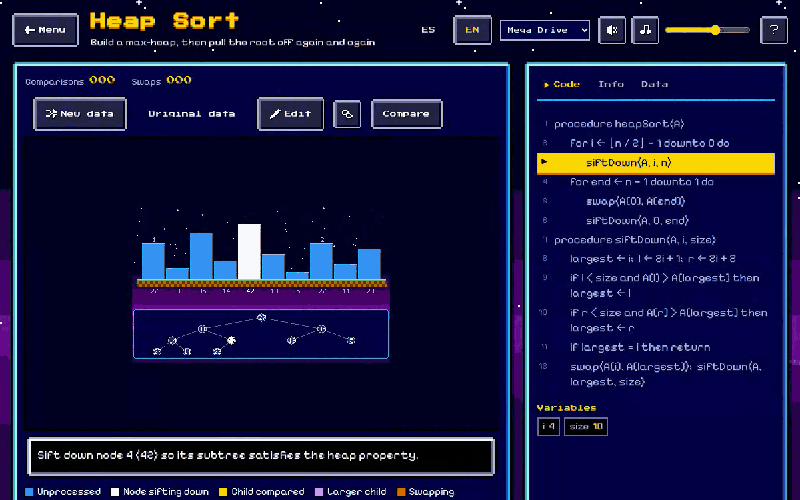
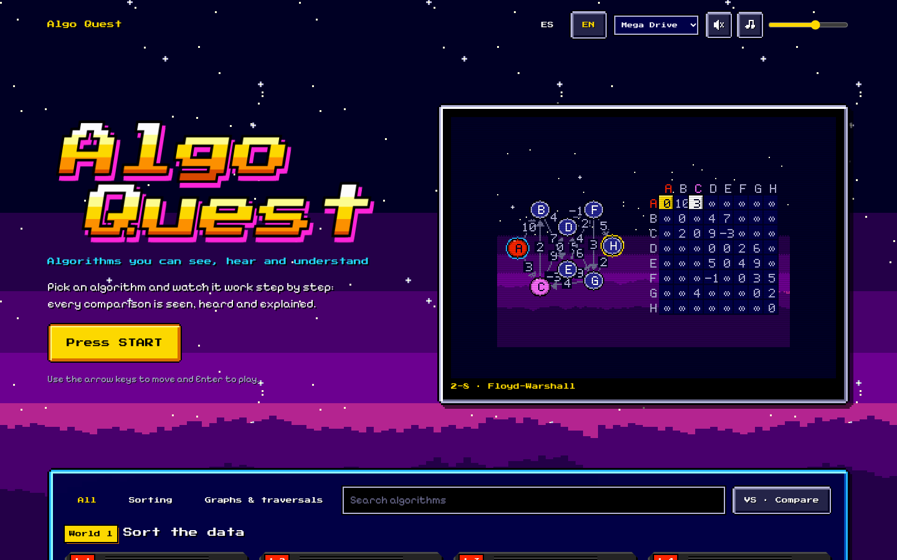
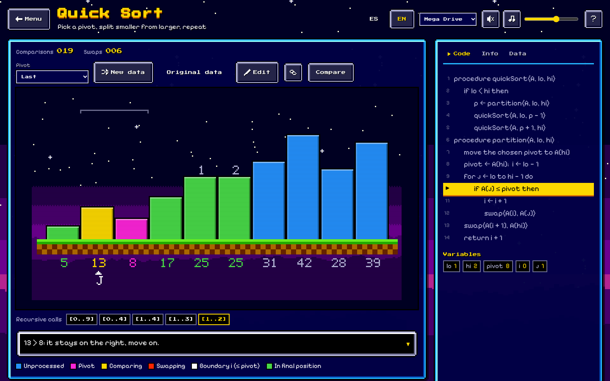
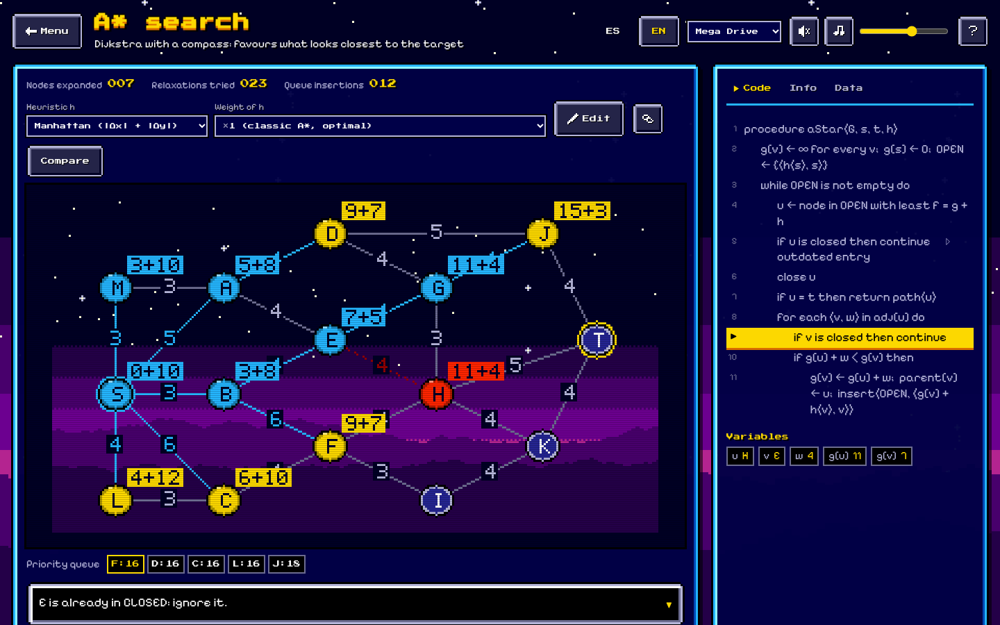
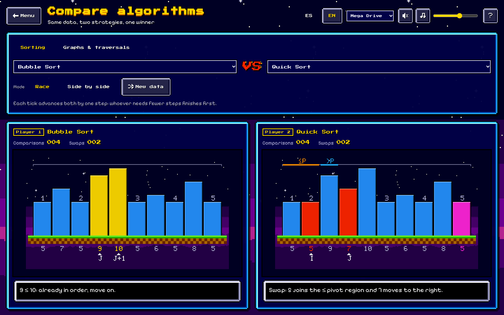
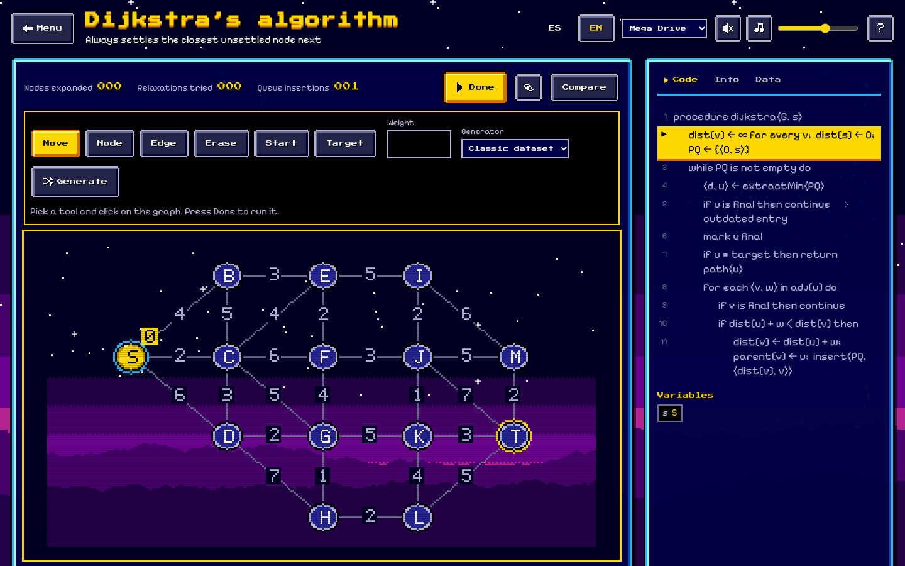
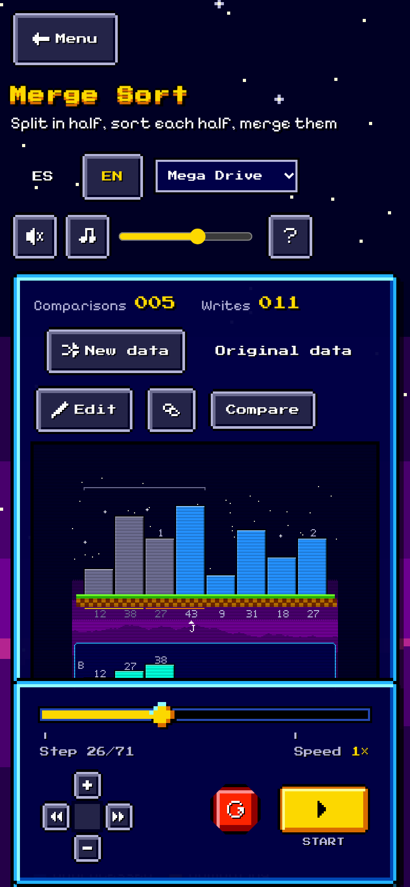

<div align="center">

# 🎮 Algo Quest

**Un visualizer y playground de algoritmos de computer science, con alma de consola de 16 bits.**

[](https://josemiguez98.github.io/algo-quest/)

[](https://github.com/JoseMiguez98/algo-quest/stargazers)
[](https://github.com/JoseMiguez98/algo-quest/actions/workflows/ci.yml)
[](https://github.com/JoseMiguez98/algo-quest/actions/workflows/deploy.yml)
[](LICENSE)
<br>
[](tsconfig.json)
[](package.json)
[](#-hecho-100--con-código)
[](CONTRIBUTING.md)
[](AGENTS.md)



**[Jugar](https://josemiguez98.github.io/algo-quest/)** · **[Contribuir](CONTRIBUTING.md)** · **[Reportar un bug](https://github.com/JoseMiguez98/algo-quest/issues/new?template=bug.yml)** · **[Pedir un algoritmo](https://github.com/JoseMiguez98/algo-quest/issues/new?template=new-algorithm.yml)**

</div>

> [!TIP]
> ⭐ **¿Te gusta Algo Quest? Dejale una estrella al repo.** Es gratis, ayuda a que más gente lo encuentre y nos
> motiva a sumar algoritmos nuevos.

## ✨ Qué podés hacer

Mirá paso a paso cómo ordenan los sorts y cómo recorren los algoritmos de grafos. Después meté mano.

- 🔍 **Paso a paso, hacia adelante y hacia atrás.** Cada comparación se ve, se escucha y se explica en una narración.
- 📜 **Pseudocódigo en vivo.** La línea que se está ejecutando se resalta, junto a las variables del momento.
- 🧪 **Playground.** Editá los datos, arrastrá barras, armá tus propios grafos y laberintos, y compartilos por URL.
- ⚔️ **Modo versus.** Dos algoritmos con la misma entrada, cara a cara, con marcador en vivo.
- 🕹️ **Tres estilos.** Mega Drive, RPG de 8 bits y Moderno, cada uno con su propio sonido sintetizado.
- 🌎 **Español e inglés**, navegable con teclado y auditado con axe (WCAG AA).

**19 algoritmos** en dos mundos:

| Mundo | Algoritmos |
|---|---|
| 1 · Ordenamiento | Bubble · Selection · Insertion · Shell · Merge · Quick · Heap · Counting · Radix · Bucket |
| 2 · Grafos y recorridos | BFS · DFS · BFS bidireccional · Dijkstra · A* · Greedy best-first · Bellman-Ford · Floyd-Warshall · Backtracking (laberinto) |

## 📸 Capturas

| Portada | Quick Sort |
|---|---|
|  |  |
| **A\*** | **Modo versus** |
|  |  |
| **Playground** | **Mobile** |
|  |  |

## 🚀 Correrlo en tu máquina

```bash
npm install
npm run dev        # http://localhost:5180
npm test           # tests de exactitud (Vitest + fast-check)
npm run e2e        # tests end-to-end y de accesibilidad (Playwright + axe)
npm run build      # sitio estático en dist/
```

Para publicar en una subcarpeta (por ejemplo GitHub Pages en `/algo-quest/`): `BASE_PATH=/algo-quest/ npm run build`.
El deploy lo hace `.github/workflows/deploy.yml` en cada push a `main` o a `dev`.
El resultado en `dist/` es 100 % estático: una página por algoritmo (`/sorting/quick-sort/`), la portada y `/compare/`.

## 🧱 Hecho 100 % con código

**No hay librerías en runtime.** `package.json` no tiene `dependencies`: el sitio es TypeScript vanilla. Vite,
Vitest, Playwright y compañía son herramientas de build y de test, y no llegan al navegador.

**El sitio no trae ni un archivo de imagen ni de audio.** Todo lo que ves y escuchás se genera en el momento. Las capturas de `docs/media/` existen solo para este README y no se publican con el sitio.

| Qué | Cómo se hace |
|---|---|
| Barras, nodos, grillas y animaciones | Canvas dibujado por el renderer de cada theme |
| Marcos de ventana, botones e íconos | SVG armado en código, pixel por pixel |
| Fondos, estrellas y montañas | SVG pixel art generado con una semilla (`src/themes/megadrive/decor.ts`) y CSS |
| Texto dentro del canvas | Una fuente bitmap de 5×7 definida en `src/themes/pixel/bitmap-font.ts` |
| Efectos y música | Web Audio: ondas de pulso, triángulo, ruido LFSR y síntesis FM de 2 operadores, con música procedural |

**Recursos externos**, a la vista:
- Las tipografías de la interfaz (Press Start 2P, Pixelify Sans e Inter, todas con licencia OFL) se cargan desde Google Fonts.
- En producción se carga el contador de [GoatCounter](#-métricas).

Esa regla vale también para los aportes: nada de dependencias en runtime ni de archivos de assets.

## 🗂️ Cómo está organizado

| Carpeta | Qué hay |
|---|---|
| `src/algorithms/<categoría>/<id>/` | Un algoritmo: núcleo puro, tests, definición y textos ES/EN |
| `src/core/` | Player (paso adelante/atrás), trazas, hotkeys, settings, sonido, sesión, rutas |
| `src/scenes/` | Escenas que dibujan estados (`bars`, `graph`) y capas reutilizables (`layers/`) |
| `src/themes/` | Contrato de theme y los themes (`megadrive`, `rpg`, `modern`) |
| `src/ui/` | Componentes y paneles independientes del theme |
| `src/playground/` | Editores de datos, grafos y grillas; estado compartible por URL |
| `src/pages/` | Portada, visualizer y comparador |
| `docs/fidelity.md` | Qué variante implementa cada algoritmo y qué invariantes se testean |

La regla central: **los algoritmos solo emiten eventos semánticos** (`compare`, `swap`, `visit`, `relax`…) con un
snapshot inmutable del estado. Nunca conocen colores, sonidos ni el DOM. Las escenas traducen el estado a primitivas
(`bar`, `node`, `edge`…), y el theme decide cómo se ve y suena cada una.

## 🤖 Contribuir con AI agents

Algo Quest está pensado para contribuir **trabajando junto a un AI agent**. El repo trae las instrucciones que el
agente necesita, así que cualquiera que colabore sigue los mismos pasos, las mismas reglas y la misma vara de calidad:

| Archivo | Para qué |
|---|---|
| [`AGENTS.md`](AGENTS.md) | Reglas del proyecto para cualquier agente (Claude Code, Cursor, Codex, Copilot…) |
| [`.claude/skills/add-algorithm`](.claude/skills/add-algorithm/SKILL.md) | Agregar un algoritmo o una categoría: núcleo, tests contra referencia, contenido ES/EN y registro |
| [`.claude/skills/add-theme`](.claude/skills/add-theme/SKILL.md) | Crear un theme: tokens, CSS, renderer, sonidos y auditoría de accesibilidad |
| [`.claude/skills/contribute`](.claude/skills/contribute/SKILL.md) | Ramas, commits, PRs, releases y hotfixes |

Con [Claude Code](https://claude.com/claude-code) las skills se activan solas: pedile "agregá comb sort" o "haceme
un theme de Game Boy" y sigue el checklist completo. Con otro agente, apuntalo a `AGENTS.md`. Si preferís trabajar
sin agente, las skills se leen como checklists comunes.

Cómo empezar:
1. Leé [CONTRIBUTING.md](CONTRIBUTING.md).
2. Creá tu rama desde `dev`.
3. Abrí el PR hacia `dev`. `main` es producción.

Si encontrás un paso que el agente no supo resolver, **mejorar la skill también es un aporte**: así el próximo
colaborador no se choca con lo mismo.

## 📊 Métricas

El sitio publicado cuenta visitas y eventos de uso (play, paso atrás, edición, comparaciones) con
[GoatCounter](https://www.goatcounter.com/). GoatCounter no usa cookies ni datos personales, y respeta *Do Not Track*.
Solo se activa en producción cuando existe la variable `VITE_GOATCOUNTER`; ni en local ni en `/dev/` se envía nada.
El código está en `src/core/analytics.ts`.

## ⌨️ Atajos de teclado

`Espacio` play/pausa · `→`/`←` paso · `Home`/`End` inicio/fin · `R` reiniciar · `N` datos nuevos · `+`/`−` velocidad ·
`M` sonido · `E` modo edición · `C` código · `I` info · `?` ayuda · `Esc` cerrar.

## 💜 Colaboradores

Gracias a todas las personas que suman algoritmos, themes, traducciones y fixes.

<a href="https://github.com/JoseMiguez98/algo-quest/graphs/contributors">
  
</a>

## ⭐ Historial de estrellas

<a href="https://star-history.com/#JoseMiguez98/algo-quest&Date">
  
</a>

## 📄 Licencia

[MIT](LICENSE) © 2026 JoseMiguez98

<div align="center">

**Si Algo Quest te sirvió o te divirtió, ⭐ dejale una estrella: es la mejor forma de apoyar el proyecto.**

</div>
